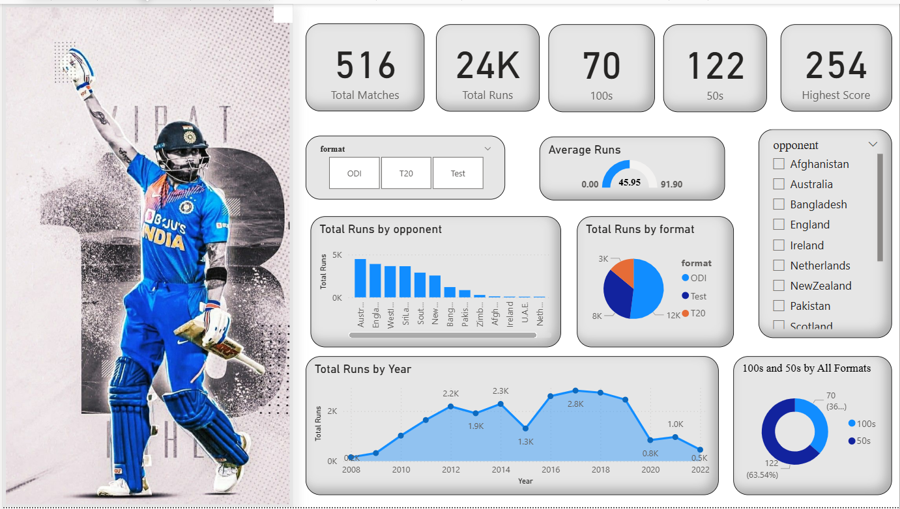

# 🏏 Virat Kohli Performance Dashboard(2008-2022) — Power BI

> An interactive Power BI dashboard analyzing Virat Kohli's international cricket career statistics across all formats.

---

##  Dashboard Preview



---

##  Dashboard Overview

This dashboard provides a comprehensive visual breakdown of Virat Kohli's batting performance, enabling fans, analysts, and data enthusiasts to explore his career stats across different match formats and opponents.

### Key Metrics (KPI Cards)
| Metric | Value |
|---|---|
| **Total Matches** | 516 |
| **Total Runs** | 24K |
| **100s** | 70 |
| **50s** | 122 |
| **Highest Score** | 254 |
| **Average Runs** | 45.95 |

---

##  Visuals Included

- **KPI Cards** — At-a-glance view of core career stats (Runs, Matches, Average, 100s, 50s, Highest Score)
- **Area Chart** — Run-scoring trend over time (by date/year)
- **Clustered Column Chart** — Performance comparison across match formats or opponents
- **Pie / Donut Charts** — Distribution of innings/runs by format or opposition
- **Gauge Chart** — Progress or benchmark visual (e.g., average vs. target)
- **Slicers** — Interactive filters by **Format** (Test, ODI, T20I) and **Opponent**
- **Player Image** — Virat Kohli portrait for a polished, professional look

---

##  Filters / Slicers

| Slicer | Options |
|---|---|
| **Format** | Test / ODI / T20I |
| **Opponent** | Filter by specific opposing teams |
| **Year** | Drill into specific time periods |

---

##  Built With

- **Power BI Desktop** (`.pbix`)
- Data source: `Source` table containing Kohli's match-level statistics
- Custom DAX measures for aggregated KPIs

---

##  Getting Started

1. **Clone or download** this repository
2. Open `virat_kholi_dashboard.pbix` in [Power BI Desktop](https://powerbi.microsoft.com/desktop/)
3. Use the slicers to filter by **format** or **opponent**
4. Hover over charts for detailed tooltips

>  The dataset is embedded within the `.pbix` file. No external data connection is required.

---

##  Repository Structure

```
📦 virat-kohli-dashboard
 ┣ 📊 virat_kholi_dashboard.pbix   # Main Power BI report file
 ┗ 📄 README.md                    # Project documentation
```

---

## 🙌 Acknowledgements

- Stats sourced from publicly available cricket databases
- Built as a data visualization portfolio project

---

## 📜 License
